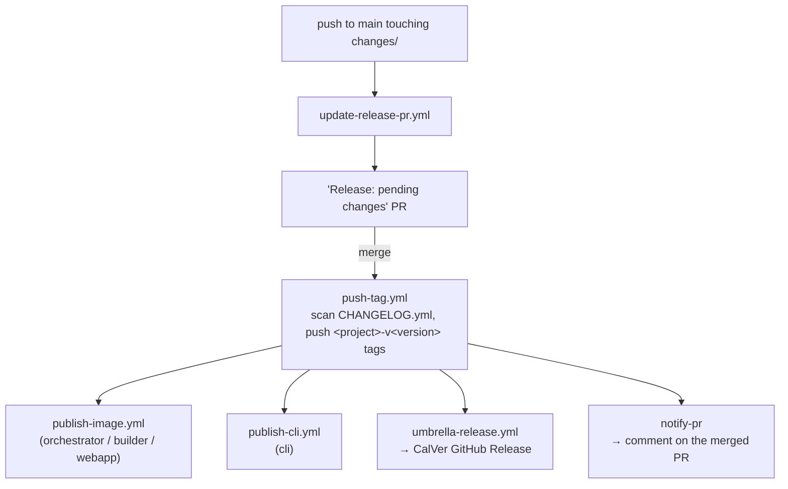

# GitHub Workflows

This directory holds the CI/CD workflows for Drover. They cover three jobs:
run tests on every change, publish SHA-tagged images on `main`, and drive the
release flow (per-component versioning → publish → umbrella release).

For the release model these workflows implement, see
[`docs/releases.md`](../../docs/releases.md) and
[`docs/versioning.md`](../../docs/versioning.md).

## Workflow files

| File | Name | What it does |
|---|---|---|
| [`test.yml`](./test.yml) | Test | Core CI. Runs orchestrator + executor unit tests (pytest), webapp tests (npm), and builds the orchestrator and webapp images with a `/health` smoke test. |
| [`cli-test.yml`](./cli-test.yml) | CLI Test | Go CLI CI. Runs `golangci-lint`, `go test -race -cover`, and a GoReleaser config check + snapshot build (no publish, no signing) to catch cross-compile/config breakage. |
| [`e2e.yml`](./e2e.yml) | E2E | Full end-to-end suite. Installs gVisor (`runsc`), runs `./e2e/run.sh ci` (including the CLI e2e scenario), and uploads service logs and Playwright results as artifacts. |
| [`publish.yml`](./publish.yml) | Publish SHA-tagged Docker images to GHCR | On every push to `main`, detects which project paths changed and builds + pushes SHA-tagged images (`orchestrator`, `builder`, `webapp`) to GHCR via `publish-image.yml`. These are not releases — just per-commit images. |
| [`update-release-pr.yml`](./update-release-pr.yml) | Update release PR | Watches `changes/` on `main`. Regenerates the pending `CHANGELOG.yml` files, force-pushes the `versioning` branch, and opens/updates the **"Release: pending changes"** PR whose body previews the version bumps. |
| [`pr-changeset-summary.yml`](./pr-changeset-summary.yml) | PR changeset summary | On normal PRs (not `versioning`), upserts a sticky comment summarizing the version bumps the PR's `changes/` files would produce, or nudges the author to add one. Validates change-file format. |
| [`push-tag.yml`](./push-tag.yml) | Tag and publish | The release entry point. When the `versioning` PR merges, it scans changed `CHANGELOG.yml` files, pushes per-component git tags (`<project>-v<version>`), invokes the publish workflows for each bumped component, then triggers the umbrella release and posts a confirmation comment (`notify-pr`) back to the merged PR. |
| [`umbrella-release.yml`](./umbrella-release.yml) | Umbrella release | **Reusable** (`workflow_call`) + manual. Builds the umbrella release: `manifest.yaml`, `changes.yml`, `install.sh`, pinned `docker-compose.yml`, cosign signatures, and `checksums.txt`, then creates the CalVer GitHub Release (`v$YEAR.$MONTH-$INCREMENT`). |
| [`publish-image.yml`](./publish-image.yml) | Publish image (reusable) | **Reusable** (`workflow_call`). Builds, pushes, and cosign-signs a single Docker image to GHCR; outputs the image digest for the umbrella manifest. |
| [`publish-cli.yml`](./publish-cli.yml) | Publish CLI (reusable) | **Reusable** (`workflow_call`). Runs GoReleaser on the `cli-v<version>` tag to build/sign/release the CLI binaries, generates the `cli-release-assets.json` sidecar consumed by the umbrella release, and uploads it as an artifact. |
| [`prune-ghcr.yml`](./prune-ghcr.yml) | Prune old SHA-only GHCR images | Housekeeping. Deletes SHA-only image versions older than N days (default 30) for `drover`, `drover-builder`, `drover-webapp`. Release-tagged versions are protected. |

### Reusable workflows

`publish-image.yml`, `publish-cli.yml`, and `umbrella-release.yml` are
`workflow_call` building blocks. They aren't triggered directly by repo events —
`push-tag.yml` calls them as part of the release flow (`umbrella-release.yml`
can also be run manually).

### How a release flows

## Triggers

| Trigger | Workflows | What it does |
|---|---|---|
| `pull_request` (default activity) | `test.yml` | Runs the full test matrix on every PR (and pushes to it). |
| `pull_request` (`opened`, `synchronize`, `reopened`, `ready_for_review`) | `pr-changeset-summary.yml` | Posts/updates the sticky changeset-summary comment. Skips the `versioning` branch. |
| `pull_request` (`closed`) | `push-tag.yml` | Only acts when a **merged** PR whose head branch is `versioning` closes: tags components, publishes them, runs the umbrella release, and comments back. |
| `pull_request` (paths `cli/**`) | `cli-test.yml` | Runs the Go lint/test/build matrix when CLI code changes. |
| `push` to `main` | `test.yml`, `publish.yml` | `test.yml` re-runs CI on the merged result; `publish.yml` builds SHA-tagged images for changed projects. |
| `push` to `main` (paths `changes/**`) | `update-release-pr.yml` | Rebuilds the pending release and updates the `versioning` PR. |
| `push` to `main` (paths `cli/**`) | `cli-test.yml` | Runs Go CI on the merged result. |
| `schedule` (Mondays 06:00 UTC) | `prune-ghcr.yml` | Weekly cleanup of stale SHA-only GHCR images. |
| `workflow_dispatch` (manual) | `e2e.yml`, `cli-test.yml`, `prune-ghcr.yml`, `push-tag.yml`, `umbrella-release.yml` | Manual runs. `e2e.yml` is dispatch-only. `prune-ghcr.yml` takes `max-age-days` / `dry-run`. `push-tag.yml` takes `project` / `version` to re-publish a component. `umbrella-release.yml` takes `drover_version` / `dry_run` / `make_latest` to (re-)cut a release. |
| `workflow_call` (reusable) | `publish-image.yml`, `publish-cli.yml`, `umbrella-release.yml` | Invoked by `push-tag.yml` during the release flow (see above), not by repo events directly. |
