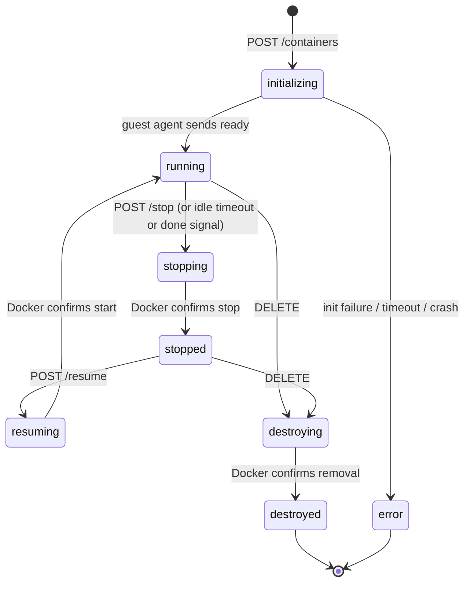

# Drover

Drover is a container orchestration tool primarily meant for homelab work.

You run an orchestrator which exposes an API through which you can launch ephemeral micro-containers.

Think of it something like a function-as-a-service where the functions are lightweight Linux operating systems.

## Terminology

| Term | Definition |
|---|---|
| **Host** | Bare metal machine running Docker (rootless) |
| **Orchestrator** | A Docker container managing the micro-container fleet |
| **Micro-container** | Short-lived ephemeral containers managed by the orchestrator |
| **Privileged micro-container** | A micro-container with access to the host Docker socket, for build and setup tasks |

---

## Overview

The orchestrator is the core application, it runs as a Docker container on the host. It exposes a REST API for callers to create, command, stop, resume, and destroy micro-containers. Each micro-container is an instance of an operator-managed image, launched on demand, communicated with via a Unix socket, and stopped or destroyed when no longer needed.

This is conceptually similar to AWS Lambda: a caller creates an image and sends commands, the orchestrator handles all lifecycle details. Arbitrary images are not permitted, only specifically named images on the host are available.

---

## Host Setup

To run this system, the host requires:

1. **Docker in rootless mode** running as the operator user
2. **The orchestrator container** started with the mounts described below
3. **At least one micro-container image** built with the required Drover labels (`drover.managed=true` and `drover.name=<name>`) so the orchestrator has something to launch (see [Image Management](#image-management))
4. (Optional) **A privileged container image** built and available on the host (required only if privileged micro-containers will be used)

The orchestrator is configured via environment variables at startup:

| Variable | Required | Default | Description |
|---|---|---|---|
| `DROVER_API_KEY` | No | _(unset)_ | SHA-256 hash of the API key. When set, all API requests (except `GET /health`) require a valid `Authorization: Bearer <key>` header. See [Authentication](#authentication). |
| `PRIVILEGED_IMAGE` | No | _(unset)_ | Docker image for privileged micro-containers. If unset, privileged container requests are rejected. |
| `DB_PATH` | No | `/var/lib/orchestrator/db.sqlite` | Path to the SQLite database file. |
| `SOCKET_DIR` | No | `/var/run/microcontainers` | Directory for per-container Unix socket files. |
| `DOCKER_SOCK` | No | `/var/run/docker.sock` | Path to the Docker daemon Unix socket. |
| `REAPER_INTERVAL_SECONDS` | No | `5` | How often (in seconds) the idle-timeout reaper runs. |
| `DROVER_INIT_TIMEOUT_SECONDS` | No | `20` | Maximum time a container may spend in `initializing` before the watchdog transitions it to `error`. |
| `LOG_LEVEL` | No | `INFO` | Python log level (`DEBUG`, `INFO`, `WARNING`, `ERROR`). |

---

## Orchestrator Container

### Host Mounts

| Host Path | Container Path | Purpose |
|---|---|---|
| `/run/user/1000/docker.sock` | `/var/run/docker.sock` | Docker-out-of-Docker: talks to the host Docker daemon |
| `/var/run/microcontainers/` | `/var/run/microcontainers/` | Shared directory for per-micro-container Unix sockets |
| `/var/lib/orchestrator/db.sqlite` | `/var/lib/orchestrator/db.sqlite` | Persistent state database |

### Dependencies

The orchestrator is built on FastAPI (with Uvicorn), aiosqlite for async SQLite access, and httpx for Docker API communication. Notably, there is no Docker Python SDK — the orchestrator talks directly to the Docker Engine REST API over the mounted Unix socket via httpx. This keeps the dependency tree minimal and gives full control over API calls.

### Responsibilities

- Exposes a REST API for micro-container lifecycle management
- Maintains state in SQLite (for each micro-container: container ID, image, privileged flag, status, socket path, other metadata)
- Creates Unix sockets per micro-container in the shared socket directory before a container is started
- Issues Docker API calls to create, start, stop, and destroy micro-containers
- Routes commands and responses between API callers and micro-containers via those sockets

### Security

- Standard micro-containers run under gVisor (`--runtime=runsc`) for syscall interception
- Orchestrator itself runs as UID 1000 to match the rootless Docker daemon

---

## Authentication

The orchestrator supports optional bearer-token authentication via the `DROVER_API_KEY` environment variable. When set, every API request (except `GET /health`) must include an `Authorization: Bearer <key>` header. Requests without a valid token receive a `401 Unauthorized` response.

This is designed as a simple security layer for homelab use. If you plan to expose the API to the public internet, you should add additional layers of security (reverse proxy with TLS, IP allowlisting, etc.).

### Setup

1. Generate a key and its SHA-256 hash using the included helper script:

```
python scripts/generate_api_key.py
```

Example output:

```
Plain-text key : m7x...Qf8
SHA-256 hash   : a1b2c3d4...

Set the hash as your environment variable:
  export DROVER_API_KEY="a1b2c3d4..."

Pass the plain-text key in API requests:
  curl -H 'Authorization: Bearer m7x...Qf8' http://localhost:8000/images
```

You can also hash an existing key:

```
python scripts/generate_api_key.py --key "my-secret-key"
```

2. Pass the **hash** (not the plain-text key) to the orchestrator via the `DROVER_API_KEY` environment variable:

```
docker run -e DROVER_API_KEY="a1b2c3d4..." ...
```

3. Include the **plain-text key** in API requests:

```
curl -H "Authorization: Bearer m7x...Qf8" http://localhost:8000/containers
```

### How It Works

The caller sends the plain-text API key in the `Authorization: Bearer` header. The orchestrator hashes the provided key with SHA-256 and compares it (using constant-time comparison) against the pre-hashed value in `DROVER_API_KEY`. The plain-text key is never stored on the server.

If `DROVER_API_KEY` is not set, authentication is disabled and all requests are allowed. The orchestrator logs a warning at startup when authentication is disabled.

The `GET /health` endpoint is always accessible without authentication so that load balancers and monitoring tools can check availability.

---

## Micro-Container

Both standard and privileged micro-containers share the same lifecycle, socket protocol, and timeout mechanics. The only differences are the image used and the sockets mounted into them.

### Mounts

| | Standard | Privileged |
|---|---|---|
| `/run/orchestrator.sock` | Orchestrator command socket | Orchestrator command socket |
| `/run/docker.sock` | No | Passes through host Docker socket |
| gVisor runtime | Yes | No |

A privileged micro-container uses the image named by `PRIVILEGED_IMAGE` directly and is not subject to the `drover.managed` label requirement. It also bypasses gVisor, allowing for more system interop as needed.

### Socket Protocol

The socket at `/run/orchestrator.sock` is the single bidirectional communication channel, carrying newline-delimited JSON. The guest agent connects once at startup and maintains a persistent connection.

**Inbound (orchestrator-to-container):**

```json
{ "type": "command", "id": "abc123", "exec": "git clone https://github.com/org/repo" }
```

**Outbound (container-to-orchestrator):**

```json
{ "type": "ready" }
{ "type": "heartbeat" }
{ "type": "output", "id": "abc123", "stream": "stdout", "data": "Cloning into 'repo'..." }
{ "type": "output", "id": "abc123", "stream": "stderr", "data": "Receiving objects: 100%" }
{ "type": "result", "id": "abc123", "exit_code": 0 }
{ "type": "done" }
```

The `ready` message is sent once after the guest agent finishes its startup work (see [Container Initialization](docs/container-initialization.md)). The orchestrator transitions the container from `initializing` to `running` only when this message arrives.

The normal stdout captured by Docker logs is unstructured debug output only, it has no semantic meaning to the orchestrator or Drover overall.

### Done Signal

A container can send `{"type": "done"}` to indicate it has finished its work and is ready to be stopped. The orchestrator immediately initiates the `running → stopping → stopped` transition, without waiting for the idle timeout. This is useful for short-lived containers that complete a task and want to release resources promptly.

### Timeout and Auto-Stop

Each container provides an idle timeout set at creation time. The orchestrator tracks `last_seen` per container, updated on every inbound socket message (including heartbeats). A background task periodically checks all running containers and stops any where `now - last_seen > timeout`.

This means:

- A container that never connects is stopped after timeout
- A container that finishes work and goes quiet is stopped after timeout
- A container whose process crashes stops sending heartbeats and is stopped after timeout
- A container that sends a `done` signal is stopped immediately

The guest agent is responsible for sending heartbeats at an interval shorter than the configured timeout. To shut down early, the agent can send a `done` signal.

---

## Image Management

### Label Contract

Workload images are identified by two Docker labels baked in at build time:

| Label | Value | Required |
|---|---|---|
| `drover.managed` | `"true"` | yes |
| `drover.name` | short name used to launch containers (e.g. `"python-runner"`) | yes |

An image without both labels is invisible to Drover. The `drover.*` namespace is reserved for future Drover-specific metadata (templates, versions, etc.).

Because labels are baked into the image and survive re-tagging, the same image can be pulled from any registry (e.g. `ghcr.io/saibotsivad/drover-builder:latest`) and the orchestrator will still recognise it by label.

List and validation operations use `docker image ls --filter label=drover.managed=true`.

The privileged image is operator-supplied, named by the `PRIVILEGED_IMAGE` env var, and is not managed through the image or container API.

### Image Build

Because a privileged micro-container has access to the host Docker socket and shares the same lifecycle as any other container, image building is just another container workload that the Drover operator manages.

The only constraint is that the resulting image must carry the required labels. In a `Dockerfile`:

```dockerfile
LABEL drover.managed="true"
LABEL drover.name="my-image"
```

Or, if the image is defined in a `docker-compose.yml`, the same labels can be applied at build time via the `labels` key on the build step:

```yaml
services:
  my-image:
    build:
      context: ./my-image
      labels:
        drover.managed: "true"
        drover.name: "my-image"
```

(These are build-time labels on the image itself, not runtime labels on a service container — keep them under `build.labels`, not the top-level `labels` field.)

To label a pre-built upstream image (one that doesn't already carry the Drover labels), use `dockerfile_inline` to derive a thin image that just adds them:

```yaml
services:
  builder:
    image: my-org/drover-builder:latest
    build:
      context: .
      dockerfile_inline: |
        FROM ghcr.io/saibotsivad/drover-builder:latest
        LABEL drover.managed="true"
        LABEL drover.name="builder"
```

Compose has no way to attach labels to an image it merely pulls — it can only add labels to images it builds — so the inline `FROM` is what makes the new labels stick. If the upstream image already carries the Drover labels (anything published from this repo does), skip the `build:` block and just `image:` it directly; labels are baked into the image and travel with it.

### Image API

| Method | Path | Description |
|---|---|---|
| `GET` | `/images` | List all Drover-managed images (those carrying `drover.managed=true`) |
| `GET` | `/images/{name}` | Get status and metadata for the image whose `drover.name` matches `{name}` |

---

## Container API

| Method | Path | Description |
|---|---|---|
| `POST` | `/containers` | Start a micro-container from a managed image |
| `GET` | `/containers/{id}` | Get current state and metadata |
| `POST` | `/containers/{id}/exec` | Send a command |
| `POST` | `/containers/{id}/stop` | Stop the container (resumable) |
| `POST` | `/containers/{id}/resume` | Resume a stopped container |
| `DELETE` | `/containers/{id}` | Stop and destroy the container |

### Create Request Example

```json
{
  "image": "python-runner",
  "privileged": true,
  "env": { "SOME_VAR": "value" },
  "label": "job-789",
  "timeout_seconds": 300
}
```

- If `privileged` is `true` and `PRIVILEGED_IMAGE` is not set, the request is rejected.
- If `privileged` is `false` or omitted, the orchestrator validates that a Drover-managed image with a matching `drover.name` label is installed.

### Request Validation

All fields on the create request are validated before the container is created.

| Field | Constraints |
|---|---|
| `image` | Alphanumeric, dots, hyphens, and underscores only. Slashes separate path components (e.g. `myorg/my-image`). Each component must start and end with an alphanumeric character. Max 256 characters. |
| `label` | Printable characters only (tabs and newlines are allowed, control characters are rejected). Max 1024 characters. |
| `env` keys | POSIX-style identifiers: must start with a letter or underscore, followed by letters, digits, or underscores (`[A-Za-z_][A-Za-z0-9_]*`). Max 256 characters per key. |
| `env` values | Max 32 768 characters (32 KB) per value. |
| `timeout_seconds` | Must be between 1 and 86 400 (24 hours). Defaults to 300 (5 minutes). |

---

## Lifecycle State Machine

Applies equally to standard and privileged containers.



A stopped container retains its filesystem layer and can be resumed. Destroyed containers are fully removed.

`POST /containers` returns immediately with status `initializing`. The Docker create/start work and the guest-agent startup happen in the background; the container is ready to accept exec commands only once status reaches `running`. See [Container Initialization](docs/container-initialization.md) for the full flow.

When initialization fails (Docker error, timeout, or an orchestrator restart mid-init), the container moves to `error` with an `error_code` field explaining the cause:

| `error_code` | Meaning |
|---|---|
| `init_docker_error` | Docker create or start call failed during initialization. |
| `init_timeout` | Initialization did not complete within `DROVER_INIT_TIMEOUT_SECONDS`. |
| `orchestrator_crash` | The orchestrator restarted while the container was still initializing. |

The intermediate states (`stopping`, `resuming`, `destroying`) are transient guard rails. The API returns `409 Conflict` if you attempt an action that conflicts with a transition already in progress.

---

## Testing

The test suite is split into two independent test runs:

**Orchestrator tests** (`tests/`): Unit tests for ID generation, config, models, database, and the container manager state machine. Uses pytest-asyncio for async fixture and test support.

```
pytest tests/ -v
```

**Executor tests** (`executor/tests/`): Tests for the guest-agent library — wire protocol encode/decode, real subprocess execution with streaming, and full agent lifecycle against mock Unix socket servers. These run with pytest-asyncio disabled to avoid event-loop conflicts on Python 3.12; async tests are executed via a custom conftest hook using `loop.run_until_complete()` (see `executor/tests/conftest.py` for details).

```
pytest executor/tests/ -v -p no:asyncio -p no:anyio
```

The `test.yml` GitHub Actions workflow runs both test suites on every PR, along with a Docker build and `/health` smoke test.

## Releasing

Versions are driven by human-authored change files dropped into `changes/`
as part of any PR that should bump a project's version. See
[`docs/versioning.md`](docs/versioning.md) for the full lifecycle and the
[`changes/README.md`](changes/README.md) quick reference for the file format.

The short version: add a YAML file under `changes/` describing which
projects the PR affects and how (`major` / `minor` / `patch` plus a
description). When the PR merges to `main`, an `update-release-pr` workflow
rolls all pending bumps into a single "Release: pending changes" PR on the
`versioning` branch. Merging that PR pushes per-project git tags
(`<project>-v<version>`), which the existing publish workflows turn into
unprefixed Docker tags on GHCR. `executor` is versioned but not published;
its tags are a release record only.

## Open Issues

See `TODO.md` for the full list of remaining work and open design decisions.
