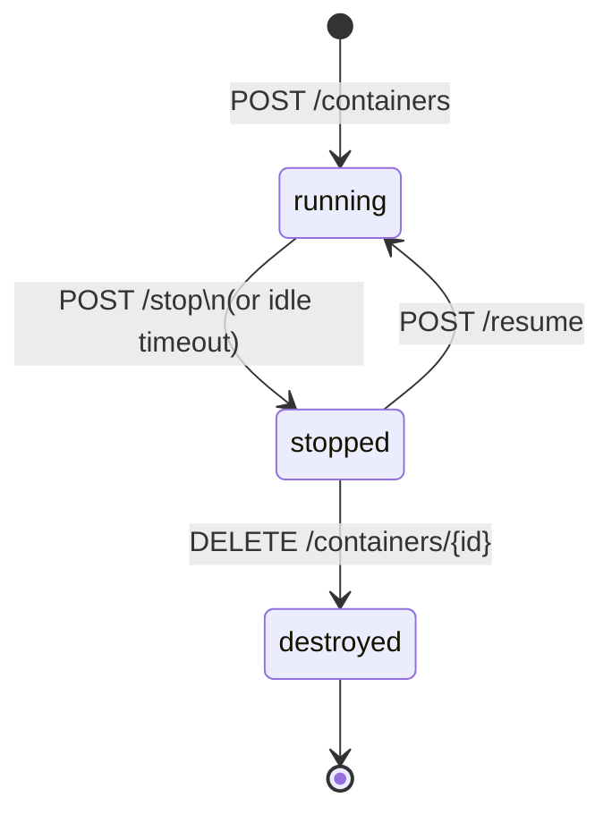

# Drover

Drover is a container orchestration tool primarily meant for homelab work.

You run an orchestrator which exposes an API through which you can launch ephemeral micro-containers.

Think of it something like a function-as-a-service where the functions are lightweight Linux operating systems.

## Terminology

| Term | Definition |
|---|---|
| **Host** | Bare metal machine running Docker (rootless) |
| **Orchestrator** | A Docker container managing the micro-container fleet |
| **Micro-container** | Short-lived ephemeral containers managed by the orchestrator |
| **Privileged micro-container** | A micro-container with access to the host Docker socket, for build and setup tasks |

---

## Overview

The orchestrator is the core application, it runs as a Docker container on the host. It exposes a REST API for callers to create, command, stop, resume, and destroy micro-containers. Each micro-container is an instance of an operator-managed image, launched on demand, communicated with via a Unix socket, and stopped or destroyed when no longer needed.

This is conceptually similar to AWS Lambda: a caller creates an image and sends commands, the orchestrator handles all lifecycle details. Arbitrary images are not permitted, only specifically named images on the host are available.

---

## Host Setup

To run this system, the host requires:

1. **Docker in rootless mode** running as the operator user
2. **The orchestrator container** started with the mounts described below
3. (Optional) **A privileged container image** built and available on the host (required only if privileged micro-containers will be used)

The orchestrator is configured via environment variables at startup:

| Variable | Required | Description |
|---|---|---|
| `PRIVILEGED_IMAGE` | No | Name of the Docker image to use for privileged micro-containers. If unset, privileged container requests are rejected. |

---

## Orchestrator Container

### Host Mounts

| Host Path | Container Path | Purpose |
|---|---|---|
| `/run/user/1000/docker.sock` | `/var/run/docker.sock` | Docker-out-of-Docker: talks to the host Docker daemon |
| `/var/run/microcontainers/` | `/var/run/microcontainers/` | Shared directory for per-micro-container Unix sockets |
| `/var/lib/orchestrator/db.sqlite` | `/var/lib/orchestrator/db.sqlite` | Persistent state database |

### Responsibilities

- Exposes a REST API for micro-container lifecycle management
- Maintains state in SQLite (for each micro-container: container ID, image, privileged flag, status, socket path, other metadata)
- Creates Unix sockets per micro-container in the shared socket directory before a container is started
- Issues Docker API calls to create, start, stop, and destroy micro-containers
- Routes commands and responses between API callers and micro-containers via those sockets

### Security

- Standard micro-containers run under gVisor (`--runtime=runsc`) for syscall interception
- Orchestrator itself runs as UID 1000 to match the rootless Docker daemon

---

## Micro-Container

Both standard and privileged micro-containers share the same lifecycle, socket protocol, and timeout mechanics. The only differences are the image used and the sockets mounted into them.

### Mounts

| | Standard | Privileged |
|---|---|---|
| `/run/orchestrator.sock` | Orchestrator command socket | Orchestrator command socket |
| `/run/docker.sock` | No | Passes through host Docker socket |
| gVisor runtime | Yes | No |

A privileged micro-container uses the image named by `PRIVILEGED_IMAGE` and does not use a `drover/`-prefixed image. It also bypasses gVisor, allowing for more system interop as needed.

### Socket Protocol

The socket at `/run/orchestrator.sock` is the single bidirectional communication channel, carrying newline-delimited JSON. The guest agent connects once at startup and maintains a persistent connection.

The exact data structure is not yet defined, but will look something like this:

**Inbound (orchestrator-to-container):**

```json
{ "type": "command", "id": "abc123", "exec": "git clone https://github.com/org/repo" }
```

**Outbound (container-to-orchestrator):**

```json
{ "type": "heartbeat" }
{ "type": "output", "id": "abc123", "stream": "stdout", "data": "Cloning into 'repo'..." }
{ "type": "output", "id": "abc123", "stream": "stderr", "data": "Receiving objects: 100%" }
{ "type": "result", "id": "abc123", "exit_code": 0 }
```

The normal stdout captured by Docker logs is unstructured debug output only, it has no semantic meaning to the orchestrator or Drover overall.

### Timeout and Auto-Stop

Each container provides an idle timeout set at creation time. The orchestrator tracks `last_seen` per container, updated on every inbound socket message (including heartbeats). A background task periodically checks all running containers and stops any where `now - last_seen > timeout`.

This means:

- A container that never connects is stopped after timeout
- A container that finishes work and goes quiet is stopped after timeout
- A container whose process crashes stops sending heartbeats and is stopped after timeout

The guest agent is responsible for sending heartbeats at an interval shorter than the configured timeout, and can send an exit-code prior to timeout to shut down early.

---

## Image Management

### Naming Convention

All operator-managed workload images are tagged with the prefix `drover/` (e.g. `drover/python-runner`, `drover/node-sandbox`). This prefix distinguishes them from everything else on the host. List and validation operations use `docker image ls --filter=reference=drover/*`.

The privileged image is operator-supplied, named by the `PRIVILEGED_IMAGE` env var, and is not managed through the image or container API.

### Image Build

Because a privileged micro-container has access to the host Docker socket and shares the same lifecycle as any other container, image building is just another container workload that the Drover operator manages.

The only constraint is that whatever process builds the image must tag it with the `drover/` prefix so the orchestrator can find it.

### Image API

| Method | Path | Description |
|---|---|---|
| `GET` | `/images` | List all `drover/*` images and their status |
| `GET` | `/images/{name}` | Get status and metadata for a specific image |

---

## Container API

| Method | Path | Description |
|---|---|---|
| `POST` | `/containers` | Start a micro-container from a managed image |
| `GET` | `/containers/{id}` | Get current state and metadata |
| `POST` | `/containers/{id}/exec` | Send a command |
| `POST` | `/containers/{id}/stop` | Stop the container (resumable) |
| `POST` | `/containers/{id}/resume` | Resume a stopped container |
| `DELETE` | `/containers/{id}` | Stop and destroy the container |

### Create Request Example

The exact data model for containers is not yet decided, but it will look something like this:

```json
{
  "image": "python-runner",
  "privileged": true,
  "env": { "SOME_VAR": "value" },
  "label": "job-789",
  "timeout_seconds": 300
}
```

- If `privileged` is `true` and `PRIVILEGED_IMAGE` is not set, the request is rejected.
- If `privileged` is `false` or omitted, the orchestrator validates that `drover/<image>` exists and is in a ready state.

---

## Lifecycle State Machine

Applies equally to standard and privileged containers.



A stopped container retains its filesystem layer and can be resumed. Destroyed containers are fully removed.

---

## Open Issues

- **Command streaming**: Decide between SSE, WebSocket, or polling for streaming exec output to callers.
- **Auth**: The orchestrator REST API has no auth defined yet.
- **Container message types** - The data structure between orchestrator and container is not defined yet.
  - Need some way for the container to send a message that it can be shut down and deleted.
- **Container logs** - Docker logs from a container should be retained for some amount of time, even after the container is fully shut down / deleted. Logs should be an API endpoint.
- **Container API structure** - The exact data model for containers is not yet decided
