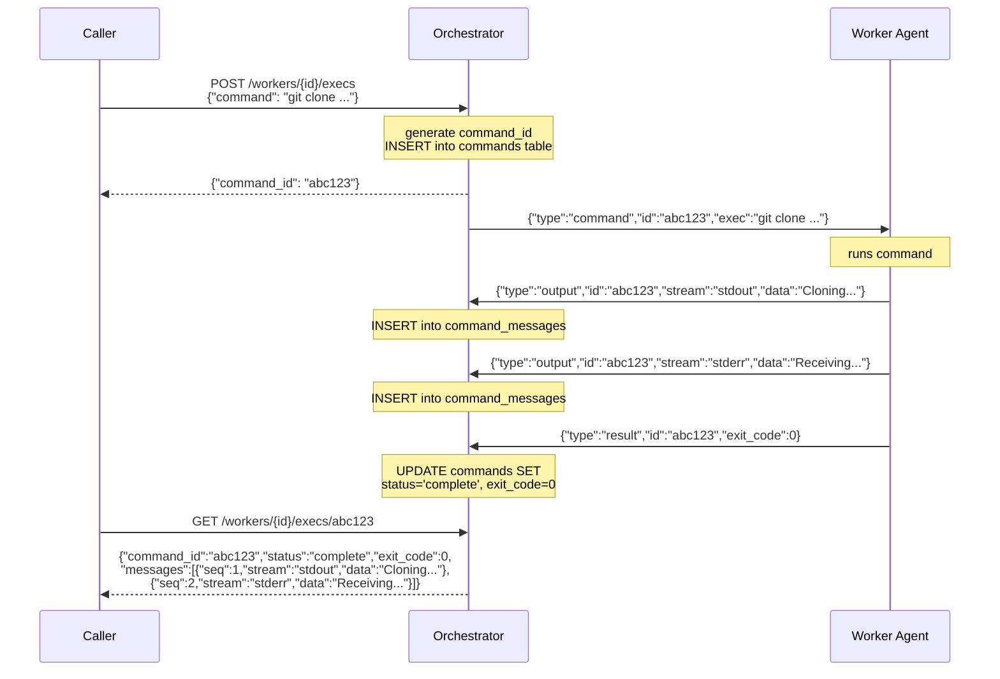

# Exec Command Flow

This document describes how commands are sent from the orchestrator to each worker, and how those results get back to the caller.

## Participants

1. **Caller** — anything that talks to the orchestrator REST API
2. **Orchestrator** — the FastAPI app, manages sockets and persists output to SQLite
3. **Worker agent** — a process inside the worker, connected to the Unix socket

## Flow

## Database Schema

### `commands` table

One row per exec invocation.

| Column | Type | Description |
|---|---|---|
| `id` | TEXT PK | The command ID returned to the caller |
| `worker_id` | TEXT FK | References `workers(id)` |
| `command` | TEXT | The exec string sent to the worker |
| `status` | TEXT | `pending`, `running`, or `complete` |
| `exit_code` | INTEGER | `NULL` until status is `complete` |
| `created_at` | TEXT | ISO 8601 timestamp |

Indexed on `worker_id` for listing all commands on a worker.

The status starts as `pending` and on first message from the worker changes to `running` or to `complete` (if the first message is an exit code). When the worker sends an exit code message, the status is changed to `complete`.

### `command_messages` table

One row per output message from the worker agent.

| Column | Type | Description |
|---|---|---|
| `seq` | INTEGER PK | Auto-incrementing sequence for ordering |
| `command_id` | TEXT FK | References `commands(id)` |
| `stream` | TEXT | `stdout` or `stderr` |
| `data` | TEXT | The output payload |
| `received_at` | TEXT | ISO 8601 timestamp |

Indexed on `command_id` for fast retrieval of all messages for a command.

## Key Details

### Command state is persisted to SQLite

Both the command metadata and every output message are written to the database as they arrive. This means:

- Each worker can have **multiple commands in flight** simultaneously. They are independent, each with their own command ID and message stream.
- Messages are ordered by `seq` (auto-incrementing), preserving the interleaved stdout/stderr order as it happened.

### Listing commands

`GET /workers/{id}/execs` returns all commands submitted against a worker, newest first. Each entry includes `command_id`, `command`, `status`, `exit_code`, and `created_at`. Commands that are still running appear in the list with `status: running`; the list is a snapshot, not a stream.

### Polling

The caller gets a command ID back immediately and polls `GET /workers/{id}/execs/{cmd_id}` to check progress. The response also includes the original `command` string. The response includes:

| Field | Type | Description |
|---|---|---|
| `command_id` | string | The ID returned from the exec call |
| `status` | string | `pending` (sent, no output yet), `running` (output received), `complete` (exit code received) |
| `exit_code` | int or null | `null` until status is `complete` |
| `messages` | array | Ordered list of `{seq, stream, data}` objects |

### Streaming

A WebSocket endpoint at `GET /workers/{id}/ws` pushes exec output (`{"type": "output", ...}`) and command-complete events (`{"type": "status", "status": "complete", ...}`) as they happen, alongside worker Docker logs. Use it for long-running commands where polling would be wasteful. The polling endpoint above is still the only way to fetch historical output for a command — the WebSocket only carries new messages from the moment the client connects. See [WebSocket stream in the orchestrator README](../orchestrator/README.md#workers) for the message schema, auth options, and a minimal client.

### How the CLI consumes the stream

`drover exec <id> -- <cmd...>` is the reference streaming client. It POSTs to `/workers/{id}/execs` to get a `command_id`, then opens the per-worker WebSocket `/workers/{id}/ws`. It filters incoming frames by that `command_id` (dropping frames for other commands and the worker's own Docker logs) and passes each matching frame through to stdout verbatim — one JSON object per line, no re-marshalling. When the matching `status:complete` frame arrives, the CLI exits with the command's `exit_code`. See [`docs/cli.md`](cli.md) for the user-facing behaviour.

### Socket protocol is newline-delimited JSON

One JSON object per line over the Unix socket at `/var/run/drover/sockets/orchestrator.sock` inside the worker. The orchestrator creates the per-worker socket folder and the socket file before starting the worker. The worker agent connects once at startup and maintains a persistent connection.

### Heartbeats are separate from commands

The worker agent sends `{"type": "heartbeat"}` on its own schedule. These have no command ID, they just update `last_seen` on the worker row in SQLite, keeping the idle-timeout reaper from stopping the worker.
