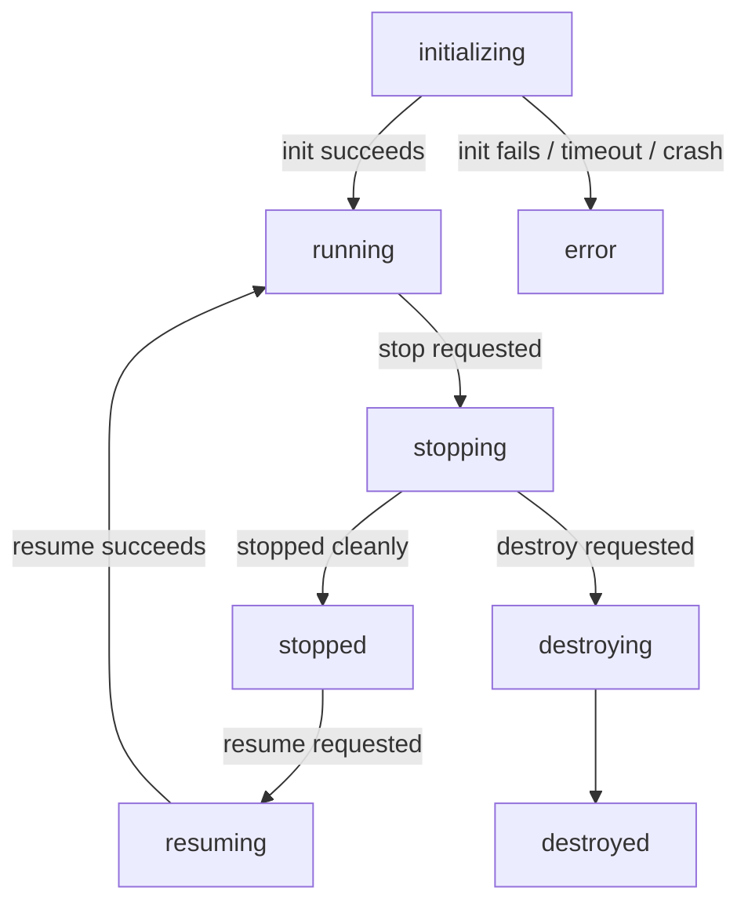

# Plan: Async Container Initialization

## Background

Currently `POST /containers` blocks until Docker has created and started the
container, then returns 201 with the container in `running` status. This means
the caller waits for the full Docker round-trip before getting a response.

The goal is to return immediately with a new `initializing` status and let the
Docker work happen in a background task, so callers can proceed to poll
`GET /containers/{id}` for the transition to `running`.

## Status Enum Changes

Two new values are added to `ContainerStatus` (`models.py`):

| Status | Meaning |
|---|---|
| `initializing` | Container row created; Docker create/start in progress |
| `error` | A non-recoverable error occurred; orchestrator has cleaned up |

The DB schema default for the `status` column (`database.py`) changes from
`'running'` to `'initializing'` for clarity, even though explicit values are
always passed on insert.

### Full status lifecycle



## Error Codes

A new `error_code` column is added to the `containers` table and exposed as an
optional field on `ContainerResponse`. It is `NULL` unless `status = 'error'`.
Values are strings drawn from a defined set:

| Code | Scenario |
|---|---|
| `init_docker_error` | Docker create or start call failed during initialization |
| `init_timeout` | Background init task exceeded the configured timeout |
| `orchestrator_crash` | Orchestrator restarted and found this container stuck in `initializing` |

## Code Changes

### 1. `models.py` — `ContainerStatus` enum and `ContainerResponse`

- Add `initializing` and `error` values to `ContainerStatus`.
- Add `error_code: str | None = None` field to `ContainerResponse`.

### 2. `database.py` — schema

- Change the `status` column default from `'running'` to `'initializing'`.
- Add `error_code TEXT` column to the `containers` table.

### 3. `config.py` — new setting

Add `DROVER_INIT_TIMEOUT_SECONDS` environment variable (default: `20`). This
caps how long the background init task is allowed to run before the container
is transitioned to `error` with code `init_timeout`.

Whether this should alternatively be a per-request field on
`CreateContainerRequest` is still under discussion. The env-var approach is
simpler and treats init time as an infrastructure concern rather than a
per-container one; feedback welcome before implementation.

### 4. `container_manager.py` — `create_container`

Split the existing method into two phases:

**Phase 1 (synchronous, before returning):**
1. Validate image / privileged config (unchanged).
2. Generate a container ID.
3. Insert the DB row with `status = 'initializing'`, `docker_id = NULL`, and
   `error_code = NULL`.
4. Return the `ContainerResponse` immediately (HTTP 201).

**Phase 2 (background task via `asyncio.create_task`):**
1. Create the Unix socket (`sockets.create_socket`). The socket must exist
   before the Docker container starts so the bind-mount target is a file rather
   than a directory.
2. Update the DB row with the `socket_path`.
3. Call `docker.create_container(...)` to get a `docker_id`.
4. Update the DB row with the `docker_id`.
5. Call `docker.start_container(docker_id)`.
6. On success: leave DB status as `'initializing'` — the transition to
   `'running'` happens only when the guest agent sends a `ready` message (see
   socket_manager change below).
7. On failure: update DB `status` to `'error'` with
   `error_code = 'init_docker_error'`, destroy the socket, and force-remove
   the Docker container if one was created.

A separate **init timeout watchdog task** is created alongside the background
task. It sleeps for `DROVER_INIT_TIMEOUT_SECONDS` and then checks whether the
container is still `initializing`. If so, it transitions to `error` with
`error_code = 'init_timeout'`, destroys the socket, and force-removes the
Docker container. The watchdog is cancelled if the container reaches `running`
(i.e. `ready` is received) or enters any error/terminal state before the
deadline. This covers both Docker failure and agent startup failure with a
single timeout.

### 5. `orchestrator/socket_manager.py` — new `ready` message handler

Add `ready` to the recognized message types. On receipt, issue:

```sql
UPDATE containers SET status = 'running' WHERE id = ? AND status = 'initializing'
```

The conditional `AND status = 'initializing'` ensures a late-arriving `ready`
(e.g. after a timeout has already fired) is silently ignored.

Cancel the init timeout watchdog task for this container if one is running.

### 6. `executor/drover_executor/protocol.py` — new message encoder

Add `encode_ready() -> bytes` alongside the existing `encode_heartbeat()` etc.

### 7. `executor/drover_executor/agent.py` — send ready after on_connect

In `Agent.run()`, send `ready` immediately after `await self.on_connect()`
returns:

```python
await self.on_connect()
await self._send(protocol.encode_ready())
```

Subclasses perform any startup work inside `on_connect()`. When it returns,
the framework sends `ready` automatically — no manual call needed. If
`on_connect()` raises, `ready` is never sent and the container stays
`initializing` until the watchdog fires.

### 8. `container_manager.py` — `exec_command`

`POST /containers/{id}/exec` must return a 409 if the container's current
status is anything other than `running`. This prevents exec commands from
silently queueing against a container that may never reach `running`.

### 9. `container_manager.py` — `sync_containers` (startup reconciliation)

`sync_containers` runs at startup to reconcile DB state against Docker.
Currently it skips rows in mid-transition statuses (`stopping`, `resuming`,
`destroying`). `initializing` must be added to that skip list so a crash
mid-init doesn't get incorrectly reconciled against a Docker container that
may not exist yet.

After the Docker reconciliation pass, any row still in `initializing` (i.e.
no matching Docker container was found) should be transitioned to `error` with
`error_code = 'orchestrator_crash'` rather than left stuck.

## What Does Not Change

- `GET /containers/{id}` — already reads directly from the DB row; no changes
  needed beyond the new `error_code` field being populated.
- `GET /containers/{id}/exec/{command_id}` — unaffected.
- Error cleanup logic — same socket destruction and force-remove steps, just
  relocated into the background task.
