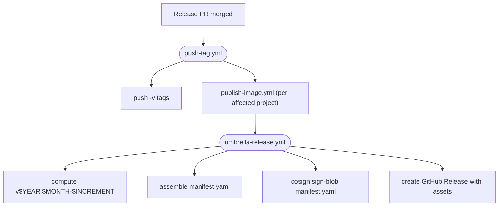

# Releases

Drover publishes artifacts to several places: GHCR (containers), PyPI
(libraries, when applicable), and GitHub Releases (small assets and the
manifest). A GitHub Release in this repository is a **manifest of
cross-links**, not a container of artifacts — it records which versions of
each component belong together and where each one was actually published.

For per-component versioning (the `<project>-v<version>` git tags, the
`changes/` workflow, the per-project `CHANGELOG.yml` files), see
[`versioning.md`](./versioning.md). This document covers the umbrella
release layer that sits on top.

## Umbrella version scheme

Drover releases use **CalVer with an in-month increment**:

```
v$YEAR.$MONTH-$INCREMENT
```

| Part | Meaning |
|---|---|
| `$YEAR` | Four-digit year, UTC at release time |
| `$MONTH` | One- or two-digit month, no zero padding (`5`, not `05`) |
| `$INCREMENT` | One-based counter, resets at the start of each month |

Examples: `v2026.5-1`, `v2026.5-2`, `v2026.6-1`.

The increment is computed by inspecting the latest existing release: if the
latest release's year and month match the current UTC year and month, the
new release's increment is that release's increment plus one; otherwise it
starts at `1`. This means multiple releases per day are supported by design.

The umbrella version is **not semver** and does not convey API stability.
Component semver continues to do that job.

## What a release contains

Every Drover release has the same shape:

**Always-present assets (small, stable URLs):**

| Asset | Purpose |
|---|---|
| `manifest.yaml` | The full cross-link manifest. Machine-readable source of truth for which component versions belong to this release. |
| `manifest.yaml.sig` | Cosign signature over `manifest.yaml`. |
| `changes.yml` | Aggregated change feed: every entry that landed in this Drover release, grouped by component, with the from/to version and per-entry bump level. The human-readable release description is rendered from this file. |
| `changes.yml.sig` | Cosign signature over `changes.yml`. |
| `install.sh` | CLI installer. Generated per release from a stable template plus this release's component data; carries the CLI binary URLs and SHA-256s as literal variable assignments at the top of the script. Does not parse `manifest.yaml`. |
| `install.sh.sig` | Cosign signature over `install.sh`. Verifying this covers every URL and checksum the installer will use. |
| `docker-compose.yml` | Operator-ready compose stack with every `image:` pinned to `<name>:<version>@sha256:<digest>` for this release. Generated from the root `docker-compose.yml` in the repo by substituting only the `image:` lines, so all comments and structure are preserved byte-for-byte. |
| `docker-compose.yml.sig` | Cosign signature over `docker-compose.yml`. |
| `checksums.txt` | SHA-256 of every asset attached to this release. |

`install.sh`, `manifest.yaml`, `changes.yml`, and `docker-compose.yml`
are generated from the same component data in the same workflow step,
so they cannot drift. Consumers verifying an install use
`install.sh.sig`; operators deploying the stack verify
`docker-compose.yml.sig`; tooling consuming the change feed verifies
`changes.yml.sig`; consumers verifying any other use of the release
data use `manifest.yaml.sig`.

**Body of the release:**

- A human-readable changelog rendered from `changes.yml` (the same data,
  formatted for humans).
- A pinned-versions table (component → version → published location)
  rendered from `manifest.yaml`.

**Not in the release:**

- Component binaries (CLI, etc.) are **not** re-uploaded. They live on the
  per-component release where they were originally built; the manifest
  cross-links to them.
- Container images are not re-uploaded. The manifest references them by
  `ghcr.io/...@sha256:...`.

## Manifest schema

`manifest.yaml` is the source of truth for a release. Its shape:

```yaml
drover: v2026.5-3
released: 2026-05-23T18:42:11Z
components:
  orchestrator:
    version: 1.2.4
    image: ghcr.io/saibotsivad/drover:1.2.4
    digest: sha256:abc...
  builder:
    version: 0.4.1
    image: ghcr.io/saibotsivad/drover-builder:0.4.1
    digest: sha256:def...
  webapp:
    version: 2.0.0
    image: ghcr.io/saibotsivad/drover-webapp:2.0.0
    digest: sha256:123...
  executor:
    version: 0.3.1
    pypi: drover-executor==0.3.1
  cli:
    version: 1.0.2
    release: https://github.com/saibotsivad/drover/releases/tag/cli-v1.0.2
    assets:
      linux-amd64:
        url: https://github.com/.../drover-linux-amd64.tar.gz
        sha256: 7f3a...
      linux-arm64:
        url: https://github.com/.../drover-linux-arm64.tar.gz
        sha256: 9c1b...
      darwin-amd64: { url: ..., sha256: ... }
      darwin-arm64: { url: ..., sha256: ... }
      windows-amd64: { url: ..., sha256: ... }
```

Every component present in the repo appears in `components`, whether or not
it changed in this release. Unchanged components carry forward the previous
release's values.

## Change feed (`changes.yml`)

`changes.yml` is the programmatic counterpart to the human-readable
release description. It lists every change that landed in this Drover
release, grouped by component, with from/to versions and per-entry bump
levels. Downstream tooling (notification bots, dependabot-style
updaters, deploy gates that block on `major`) can subscribe to it
without scraping HTML.

Shape:

```yaml
drover: v2026.5-3
previous_drover: v2026.5-2
released: 2026-05-23T18:42:11Z
changes:
  orchestrator:
    from: 1.2.3
    to: 1.2.4
    bump: patch
    entries:
      - bump: patch
        description: |
          Fixed crash on malformed input in the executor loop.
  webapp:
    from: 1.9.0
    to: 2.0.0
    bump: major
    entries:
      - bump: major
        description: |
          Renamed /api/orchestrator/* proxy endpoints to /api/v2/*.
      - bump: minor
        description: |
          Added a new dashboard view for container logs.
```

Notes:

- Only components that bumped in this release appear under `changes`. To
  enumerate every component's current version, read `manifest.yaml`
  instead.
- `from` is the version recorded for that component in the previous
  Drover release's manifest. On the very first umbrella release, or for
  a component that did not exist in the previous release, `from` is
  `null`.
- `bump` at the component level is the highest bump among its `entries`
  (the same "highest bump wins" rule documented in
  [`versioning.md`](./versioning.md)).
- Entries are listed in the order they appeared in the per-project
  `CHANGELOG.yml`. The data is identical to that file; the change feed
  just aggregates across components for one release.

## CLI release assets (`cli-release-assets.json`)

The CLI is built outside the container publish flow, so its download URLs
and checksums can't be derived from GHCR. Instead the CLI release job
emits a small sidecar JSON and uploads it as a workflow artifact named
`cli-release-assets`. The umbrella job downloads that artifact and feeds
it to the manifest builder, which populates the `cli` manifest entry and
bakes the per-platform URLs + SHA-256s into `install.sh`. This is a
workflow-to-workflow contract: changes to it require coordinated PRs
against both the CLI publish workflow (producer) and the umbrella
workflow (consumer). The builder validates the shape and fails loudly on
a missing field or platform.

```json
{
  "version": "1.0.2",
  "release_url": "https://github.com/saibotsivad/drover/releases/tag/cli-v1.0.2",
  "assets": {
    "linux-amd64":  { "url": "...", "sha256": "..." },
    "linux-arm64":  { "url": "...", "sha256": "..." },
    "darwin-amd64": { "url": "...", "sha256": "..." },
    "darwin-arm64": { "url": "...", "sha256": "..." },
    "windows-amd64":{ "url": "...", "sha256": "..." }
  }
}
```

When the CLI didn't change in a release, no artifact is produced and the
builder carries the previous manifest's `cli` block forward unchanged.

## Commitments

- **Stable install URL.** `https://github.com/saibotsivad/drover/releases/latest/download/install.sh`
  is a permanent link to the latest installer. Likewise `manifest.yaml`,
  `changes.yml`, `docker-compose.yml`, their signatures, and
  `checksums.txt`.
- **Signed manifest, change feed, and compose.** Every release's
  `manifest.yaml`, `changes.yml`, and `docker-compose.yml` are
  cosign-signed (keyless OIDC). A consumer can verify each before
  trusting it.
- **Stable change-feed schema.** The shape of `changes.yml` is part of
  the release contract. Additive changes (new optional keys) may be
  introduced without notice; breaking changes follow an announce-then-ship
  cycle on a forward release.
- **Pinned by digest.** Container references in the manifest always include
  a `sha256:` digest. Consumers can pull by digest for byte-identical
  reproducibility, independent of any mutable tag.
- **Backport-safe `latest`.** When a release is published for an older
  Drover version (e.g. a security backport), the release workflow sets
  `make_latest=false` on it so `releases/latest` continues to point at the
  most recent forward release.
- **Per-component releases are untouched.** Per-project git tags, per-project
  CHANGELOG.yml, and GHCR publish jobs continue to work exactly as described
  in [`versioning.md`](./versioning.md). The umbrella release runs after
  them, consuming their outputs.

## Lifecycle



The umbrella release is the last step of the existing release flow. It
runs only after every per-component publish job in the same release has
succeeded; if any of them fails, no umbrella release is created.

The pinned `docker-compose.yml` needs a digest for every container
component. On a normal release those come from the freshly-published
components plus the previous manifest (carried forward). The **first
umbrella release ever** has no previous manifest to carry digests from,
so it must re-publish every container component in one go — otherwise the
compose step fails loudly with the missing-digest component named. The
fix is to re-run `push-tag.yml` for the unchanged components (or land a
follow-on release once a previous manifest exists).

## Installation

End users install the CLI with:

```sh
curl -fsSL https://github.com/saibotsivad/drover/releases/latest/download/install.sh | sh
```

`install.sh`:

1. Detects OS and arch.
2. Reads the matching binary URL and SHA-256 from the literal variable
   assignments at the top of its own script body. No second network fetch,
   no YAML parsing.
3. Downloads the binary, verifies its SHA-256, extracts it, and installs
   to `/usr/local/bin/drover` (or `$DROVER_INSTALL_DIR`).

Supply-chain-conscious users can verify the installer before running it:

```sh
curl -fsSL -O https://github.com/saibotsivad/drover/releases/latest/download/install.sh
curl -fsSL -O https://github.com/saibotsivad/drover/releases/latest/download/install.sh.sig
cosign verify-blob install.sh --signature install.sh.sig \
  --certificate-identity ... --certificate-oidc-issuer ...
sh install.sh
```

Because the URLs and checksums are baked into the script body,
`install.sh.sig` covers everything the installer will fetch.

Container operators run a Drover release by downloading its pinned
compose file:

```sh
curl -fsSL -O https://github.com/saibotsivad/drover/releases/latest/download/docker-compose.yml
docker compose up -d
```

Every `image:` in the released compose file is pinned to
`<name>:<version>@sha256:<digest>` — Docker resolves the digest and
ignores tag drift, so a `compose up` is byte-identical to what was
tested at release time. Operators wanting maximum supply-chain hygiene
verify it first:

```sh
curl -fsSL -O https://github.com/saibotsivad/drover/releases/latest/download/docker-compose.yml.sig
cosign verify-blob docker-compose.yml --signature docker-compose.yml.sig \
  --certificate-identity ... --certificate-oidc-issuer ...
```

Operators with custom needs can still pin from the manifest directly:

```sh
curl -sL https://github.com/saibotsivad/drover/releases/download/v2026.5-3/manifest.yaml
```

…and reference each image by its digest in their own infrastructure.

## Re-running a release

A `workflow_dispatch` entrypoint on `umbrella-release.yml` lets an operator
regenerate the manifest for a specific Drover version without re-running
the per-component publishes. This is the recovery path for cases where the
umbrella step failed after the component publishes succeeded.
