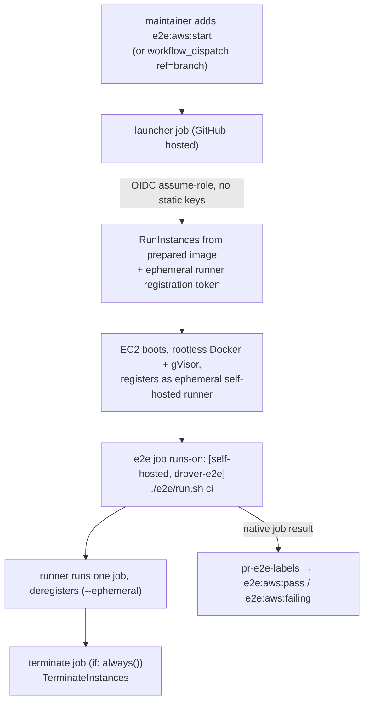

# RFC: Full end-to-end tests on ephemeral AWS EC2 self-hosted runners

**Date:** 2026-07-02
**Status:** Draft — seeking team buy-in

## Summary

Today the e2e suite (`e2e/run.sh ci`) runs on GitHub-hosted `ubuntu-latest`
runners, driven manually or via the `e2e:*` PR label flow. That gives us an
isolated, throwaway VM per run — but the Docker daemon it tests against is
GitHub's **rootful, root-owned** daemon, which is *not* the install Drover's
README recommends operators run (**rootless Docker**). We therefore never
exercise the documented production/homelab install path end-to-end.

This RFC proposes an **optional, opt-in** second e2e lane that runs the exact
same `e2e/run.sh ci` on a freshly-provisioned **EC2 instance** configured the
way we tell operators to configure their hosts: rootless Docker + gVisor. The
instance is an **ephemeral GitHub self-hosted runner** launched via **GitHub
OIDC → a scoped IAM role** (no long-lived AWS keys), so the e2e job remains a
native GitHub job — results, logs, and the existing `e2e:pass`/`e2e:failing`
labels all keep working with minimal change. The instance is terminated after
one job.

The goal of this RFC is to agree on the **direction and shape** before anyone
writes a plan or infrastructure code.

## Motivation

Two things motivate this, one primary and one secondary.

1. **Install-path fidelity (primary).** Drover's README recommends **rootless
   Docker**, and the orchestrator's most delicate machinery — the same-path
   Unix-socket bind-mount, self-inspecting for host-side mount sources, and the
   gVisor `runsc` runtime with `--host-uds=all` — behaves differently under
   rootless vs rootful Docker. GitHub-hosted runners only give us rootful,
   root-owned Docker. So the single most important thing we ship (the documented
   operator install) is the one thing our e2e never actually runs against.

2. **A clean, isolated Docker daemon we control (secondary).** A stated goal is
   a fully isolated, clean Docker install so runs don't mutate shared state or
   muddy results. **GitHub-hosted runners already provide that isolation** —
   each run is a fresh, discarded VM — so isolation alone does not justify EC2.
   What EC2 *adds* is **control**: we choose the daemon mode (rootless), the
   `daemon.json`, the gVisor version and flags, the kernel/instance type, and we
   pin all of it in a reproducible image instead of inheriting whatever the
   hosted `ubuntu-latest` image happens to be at a given time.

The case rests on fidelity to the documented install and control over the
daemon, not on isolation alone.

## Background: how e2e works today

- **`e2e/run.sh ci`** builds the orchestrator/webapp/builder images from source
  via `e2e/docker-compose.e2e.yml`, brings the stack up, runs the numbered bash
  tests + Playwright, captures logs, and tears everything down. It needs Docker
  Compose v2, `jq`, `curl`, Go 1.23 (for `07-cli.sh`), and — for
  `04-standard-container.sh` — gVisor `runsc` with `--host-uds=all` in
  `daemon.json`. See [`docs/full-e2e-suite.md`](../full-e2e-suite.md).
- **`.github/workflows/e2e.yml`** is a reusable (`workflow_call`) +
  `workflow_dispatch` workflow. On `ubuntu-latest` it installs gVisor, patches
  `daemon.json`, sets up Go, and runs `./e2e/run.sh ci`, then uploads
  `e2e/logs/` and Playwright results as artifacts.
- **`.github/workflows/pr-e2e-labels.yml`** is the operator-facing trigger: a
  maintainer adds the `e2e:start` label, which transitions
  `e2e:start → e2e:running → e2e:pass`/`e2e:failing` and calls `e2e.yml`. Labels
  are wiped on `synchronize` so stale results don't linger.

Key properties we want to preserve: **maintainer-gated triggering** (a human
adds the label — important for fork-PR safety), **native job reporting**, and
the **reusable-workflow + label-state-machine** structure.

## Proposal

Add a **parallel AWS e2e lane** that reuses the existing patterns:

1. A new reusable workflow **`e2e-aws.yml`** (`workflow_call` +
   `workflow_dispatch` with a `ref` input) that runs the **same
   `./e2e/run.sh ci`** on a **self-hosted** runner labelled `drover-e2e`.
2. A **launcher** job (GitHub-hosted) that assumes a scoped AWS IAM role via
   **GitHub OIDC** and calls `RunInstances` to start **one** EC2 instance from a
   prepared image, passing a **short-lived runner registration token** so the
   box registers itself as an **ephemeral** self-hosted runner.
3. The **e2e job** (`runs-on: [self-hosted, drover-e2e]`) runs on that instance.
   Because `--ephemeral` runners execute exactly one job and then exit, and the
   instance is configured with rootless Docker + gVisor, each run is a pristine,
   documented-install environment.
4. A **terminate** job with `if: always()` calls `TerminateInstances` so a
   passed, failed, or cancelled run never leaks the box.
5. **`pr-e2e-labels.yml`** gains a parallel label — e.g. `e2e:aws:start` — that
   calls `e2e-aws.yml` instead of `e2e.yml`, reusing the identical
   running/pass/failing transition logic. The GitHub-hosted `e2e:start` lane
   stays as the fast default.



### Why a self-hosted runner rather than "fire-and-report"

An alternative design has GitHub launch an AWS resource (e.g. a CloudFormation
stack) that runs the suite and reports back via an API call, then
self-terminates. That works, but the **ephemeral self-hosted runner** shape is
strictly less plumbing for the same outcome:

- **Reporting is native.** The e2e job is a real GitHub job, so status, the
  Checks UI, and artifact upload all work as they do today. We do **not** build
  a side channel where the instance calls the Commit Status / Check Run API with
  a threaded-in token, nor ship logs to S3/CloudWatch to retrieve them.
- **It reuses what we have.** `e2e.yml` is already a reusable workflow invoked by
  a label state machine. `e2e-aws.yml` mirrors it; the label logic is copy-adapt,
  not new design.
- **`--ephemeral` gives us the clean-slate guarantee for free** — one job per
  instance, then the box is gone.

The fire-and-report model is kept as a documented fallback (see Alternatives),
not the recommendation.

## Auth: GitHub OIDC, not stored AWS keys

The launcher authenticates to AWS with
[`aws-actions/configure-aws-credentials`](https://github.com/aws-actions/configure-aws-credentials)
using `permissions: id-token: write` and GitHub's OIDC provider. No AWS access
keys live in GitHub secrets. The IAM role's trust policy is restricted to this
repository (`repo:saibotsivad/drover:*`), and ideally further to a specific ref
or a GitHub **Environment** so only the intended path can assume it.

Least-privilege role permissions:

- `ec2:RunInstances` / `ec2:TerminateInstances` / `ec2:DescribeInstances`,
  constrained by a resource tag (e.g. `drover:e2e=true`).
- `iam:PassRole` for exactly one instance profile (the box's own role, scoped to
  only what the tests need — e.g. pulling the runner binary, optional log
  upload).

The runner registration token is minted at launch time by the launcher (via the
GitHub API / a GitHub App or fine-grained token) and passed through EC2
`UserData`; it is short-lived and single-use.

## The clean environment: prepared image

The EC2 instance must come up already configured the documented way. Two ways to
get there, with a clear migration path:

- **Bootstrap-on-boot (start here).** A stock Ubuntu AMI + a `UserData` script
  that installs rootless Docker, gVisor `runsc` with `--host-uds=all`, Go 1.23,
  `jq`/`curl`/`git`, Playwright deps, and the Actions runner, then registers.
  Simplest to stand up; no image-build pipeline. Slower per run (minutes of
  setup) and more prone to upstream drift.
- **Prebaked AMI via Packer (graduate to this).** Bake all of the above into a
  pinned AMI once, so each run boots in seconds and is byte-reproducible. This
  is also where "install Docker the right way" becomes a **first-class,
  version-controlled artifact** — arguably valuable on its own, independent of
  e2e.

Recommendation: prove the flow with bootstrap-on-boot, then move the slow/fragile
setup into a Packer AMI once the lane is stable.

## Safety rails

These are not optional for a lane that spends money and holds cloud credentials:

- **Terminate on every outcome.** The `terminate` job runs `if: always()`.
- **Reaper backstop.** A scheduled sweeper (small Lambda on an EventBridge
  schedule, or a scheduled GitHub workflow) terminates any `drover:e2e=true`
  instance older than N minutes — covers the case where the workflow itself dies
  mid-run and never reaches `terminate`.
- **Instance-side watchdog.** A systemd timer / shutdown timeout so a hung box
  self-destructs even with no external action.
- **Concurrency + cost.** A `concurrency` group (one instance per PR,
  `cancel-in-progress`) and an AWS budget alarm so runaway launches can't rack
  up cost.
- **Fork-PR safety.** The AWS role must never be assumable by untrusted PR code.
  We keep the existing maintainer-gated model (a human adds `e2e:aws:start`) and
  scope the OIDC trust so only that path can assume the role. This lane is
  **not** wired to auto-trigger on `pull_request`.

## Scriptable for an AI agent (without handing out AWS keys)

A contributor — or an AI agent granted permission to contribute — should be able
to kick this off against a working branch **without ever touching AWS
credentials**. The design keeps GitHub as the sole holder of AWS access (via
OIDC) and gives the caller only a thin wrapper:

```bash
# scripts/e2e-aws.sh  (sketch)
gh workflow run e2e-aws.yml --ref "$BRANCH"
gh run watch     # surface pass/fail + artifact link
```

Triggering therefore requires only a scoped `gh` token with `actions:write` — a
much smaller blast radius than distributing AWS keys, and every run is auditable
in the Actions log.

## What's involved

Roughly in dependency order:

1. **De-risk the environment (highest-risk unknown).** Confirm `./e2e/run.sh ci`
   actually passes under **rootless Docker + gVisor + `--host-uds=all`** on EC2,
   including the same-path socket bind-mount and the `runsc` non-privileged path
   (`04-standard-container.sh`). This is the technical crux; everything else is
   wiring. Best proven first with a throwaway bootstrap script on a manually
   launched instance.
2. **AWS identity + IAM** (OIDC provider, scoped role + trust policy, instance
   profile) — delivered as a checked-in CloudFormation/Terraform template plus
   setup docs.
3. **`e2e-aws.yml`** reusable workflow: launcher (OIDC + `RunInstances` + token)
   → self-hosted e2e job → `terminate`.
4. **Extend `pr-e2e-labels.yml`** with the `e2e:aws:*` label variant, mirroring
   the existing state machine.
5. **Reaper + watchdog + budget alarm.**
6. **Packer AMI** to make runs fast/reproducible (optional follow-up).
7. **`scripts/e2e-aws.sh`** wrapper + a **`docs/aws-e2e-suite.md`** doc mirroring
   `docs/full-e2e-suite.md`.

Things that do **not** change:

- `e2e/run.sh`, the test scripts, the compose file, and the log/artifact layout
  are all reused as-is — the whole point is to run the *same* suite in a
  different environment.
- The GitHub-hosted `e2e:start` lane stays exactly as it is (fast default).

## Benefits

- e2e finally exercises the **documented operator install** (rootless Docker +
  gVisor), closing the gap between what we test and what we ship guidance for.
- Full control over the Docker daemon, gVisor version/flags, and instance type,
  pinned reproducibly instead of inheriting the hosted-runner image.
- Reuses the existing reusable-workflow + label state machine → native
  reporting, minimal new surface area.
- Scriptable by contributors/agents through `gh` alone, with no AWS-key sprawl.
- The "install Docker the right way" image becomes a version-controlled artifact.

## Risks / open questions

- **Rootless + gVisor viability (the crux).** Does the non-privileged `runsc`
  path with `--host-uds=all` and the same-path socket bind-mount work under
  rootless Docker on EC2? If it needs concessions (e.g. rootful with a hardened
  daemon), that changes the fidelity argument and should be decided explicitly.
- **Cost and leaks.** Even with the terminate job, a workflow crash can strand an
  instance; the reaper is the backstop, but we should agree on max lifetime and
  budget thresholds.
- **Runner registration mechanics.** GitHub App vs fine-grained PAT for minting
  ephemeral registration tokens, and where that credential lives. Needs a
  decision.
- **Whether to build vs adopt.** Off-the-shelf actions/controllers exist for
  ephemeral EC2 runners (e.g. `machulav/ec2-github-runner`, Actions Runner
  Controller). Do we adopt one or keep a minimal in-repo launcher we fully
  understand? Trade-off: less code vs. a third-party dependency in the
  credentialed path.
- **Instance sizing / arch.** Default to a small on-demand x86 instance; spot and
  Graviton are possible later but add preemption/compat considerations.
- **Playwright on the box.** The Playwright runner currently runs in its own
  container within the stack; confirm it behaves identically on the EC2 daemon.

## Alternatives considered

- **Do nothing / stay on GitHub-hosted runners.** Cheapest and already isolated,
  but never tests the rootless install path — the primary motivation.
- **Fire-and-report CloudFormation template.** GitHub launches a stack whose
  `UserData` runs the suite and reports back via the Commit Status / Check Run
  API, then self-terminates. This fully decouples AWS from GitHub Actions, but we
  own token threading, reliable callback (even on crash), and log retrieval
  (S3/CloudWatch). Kept as a fallback if the AWS side ever needs to be
  independent of GitHub Actions.
- **Static AWS keys in GitHub secrets** instead of OIDC. Rejected: long-lived
  cloud credentials in CI are exactly the blast-radius we don't want, especially
  for an agent-triggerable lane.

## Recommendation

Adopt the **ephemeral EC2 self-hosted runner + GitHub OIDC** lane as an opt-in
parallel to the existing GitHub-hosted e2e, gated by a maintainer-added
`e2e:aws:start` label. Start by **de-risking the rootless-Docker + gVisor
environment** (step 1) before building the full GitHub↔AWS wiring, use
**bootstrap-on-boot first / Packer AMI later**, keep **AWS credentials inside
GitHub via OIDC** (agents trigger through `gh` only), and treat the
**terminate job + reaper + budget alarm** as non-negotiable from day one. If the
rootless path proves unworkable, revisit the fidelity claim before committing
further.

## Related

- [`docs/full-e2e-suite.md`](../full-e2e-suite.md) — the suite this lane reuses verbatim.
- [`docs/install-runsc-gvisor.md`](../install-runsc-gvisor.md) — gVisor install + `--host-uds=all` rationale.
- [`e2e/run.sh`](../../e2e/run.sh) — the `ci` entry point that runs unchanged on the EC2 box.
- [`.github/workflows/e2e.yml`](../../.github/workflows/e2e.yml) — the reusable workflow `e2e-aws.yml` mirrors.
- [`.github/workflows/pr-e2e-labels.yml`](../../.github/workflows/pr-e2e-labels.yml) — the label state machine to extend.
- [`.github/workflows/README.md`](../../.github/workflows/README.md) — current CI/CD overview.
