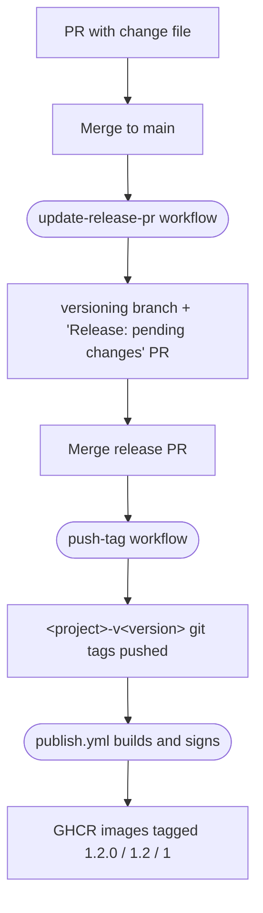

# Versioning

Drover ships several independently-versioned projects out of one repository.
Versioning is driven entirely by human-authored YAML files in the [`/changes`](../changes) folder, and runs on a small set of
GitHub Actions workflows and a Python script.

## Versioned projects

| Project | Path | Published as |
|---|---|---|
| `orchestrator` | `orchestrator/` | GHCR Docker image (`ghcr.io/<owner>/drover`) |
| `builder` | `builder/` | GHCR Docker image (`ghcr.io/<owner>/drover-builder`) |
| `webapp` | `webapp/` | GHCR Docker image (`ghcr.io/<owner>/drover-webapp`) |
| `executor` | `executor/` | Not published — git tags only |

Each project owns a `CHANGELOG.yml` at its top level. That file is the authoritative version record for that project.

## Lifecycle



1. **Contributor PR.** Whoever is making the change drops a YAML file under
   `changes/` describing which project(s) the PR affects and at what bump
   level. Multiple files can sit there at once — one per in-flight feature.
2. **Merge to `main`.** The `update-release-pr` workflow fires, reads every
   change file, applies the bumps to each affected `CHANGELOG.yml`, deletes
   the consumed change files, and force-pushes the result as a single commit
   to the `versioning` branch. It then creates or updates a "Release:
   pending changes" PR whose body summarises every pending bump, grouped by
   project.
3. **Merge the release PR.** The `push-tag` workflow diffs the merge commit
   against its parent, finds every `*/CHANGELOG.yml` that changed, reads
   each new `published` value, and pushes a git tag of the form
   `<project>-v<version>` (e.g. `orchestrator-v0.2.0`).
4. **Publish.** Each prefixed tag is the trigger for `publish.yml`. The
   captured Docker tags are unprefixed (`0.2.0`, `0.2`, `0`, plus
   `sha-<short>`) — only the git tags carry the project prefix.

A PR that doesn't include a change file is a no-op for releases.

## Change file format

Files live under `changes/` and end in `.yaml` or `.yml`. Filename is up to
the contributor; convention is to use the branch or feature name to reduce
merge collisions (e.g. `fix-auth-timeout.yaml`).

Each file is a YAML list. One file may cover multiple projects:

```yaml
- project: orchestrator
  bump: minor
  description: |
    Refactored job queue to support parallel execution across agents.
- project: builder
  bump: patch
  description: |
    Updated base image to address CVE-2026-1234.
```

| Field | Required | Notes |
|---|---|---|
| `project` | yes | Must match a top-level directory containing a `CHANGELOG.yml`. |
| `bump` | yes | One of `major`, `minor`, `patch`. |
| `description` | yes | Free-form Markdown. Use a `\|` block scalar for multi-line text. |

### Versioning rules

- **Semver, no prereleases.** Versions are `MAJOR.MINOR.PATCH`, starting at
  `0.0.0`. There is no current support for `-rc.1` or similar suffixes.
- **Highest bump wins per project.** If multiple change files affect the same
  project — possibly from different in-flight PRs that all merge before the
  release PR is merged — the script picks the highest bump (`major` > `minor` >
  `patch`) and rolls every entry into one new version under that bump. All
  individual descriptions are preserved in the changelog.
- **Within a single release**, each project moves at most one version
  forward. The release PR is the unit of release; it doesn't matter how many
  individual change files contributed to it.

## Per-project `CHANGELOG.yml`

Every versioned project has one. Created automatically the first time you
add a project (see "Adding a new project" below); seeded at `0.0.0` with an
empty history.

```yaml
published: "0.1.0"
changes:
  - version: "0.1.0"
    date: "2026-05-09"
    entries:
      - bump: minor
        description: |
          Refactored job queue to support parallel execution across agents.
  - version: "0.0.1"
    date: "2026-04-01"
    entries:
      - bump: patch
        description: |
          Fixed crash on malformed input in the executor loop.
```

`published` is the authoritative current version. The `changes` list is
newest-first. Dates are UTC at the moment the release PR is built.

This file is YAML rather than Markdown so downstream tooling (release notes,
status pages, the webapp itself) can consume it programmatically. Render to
Markdown on demand if a human wants to read it.

## Tag scheme

Git tags carry the project prefix; Docker tags do not.

| What | Format | Example |
|---|---|---|
| Git tag | `<project>-v<MAJOR.MINOR.PATCH>` | `orchestrator-v0.2.0` |
| Docker full tag | `<MAJOR.MINOR.PATCH>` | `0.2.0` |
| Docker minor tag | `<MAJOR.MINOR>` | `0.2` |
| Docker major tag | `<MAJOR>` | `0` |
| Docker SHA tag | `sha-<short>` | `sha-1a2b3c4` |

The git-tag prefix exists so each project has its own tag namespace; the
publish workflows filter by prefix to know which image to build. The Docker
tags stay unprefixed because the project name is already encoded in the
image name (`drover` vs `drover-builder` vs `drover-webapp`).

`executor` produces a git tag (`executor-v<version>`) but no Docker image
— there's no listener for `executor-v*` and that's intentional. Its tags
exist purely as a release record.

## Pre-release SHA images

Release-tagged images are not the only thing in GHCR. Every merge to `main`
that touches a publishable project's directory produces an image tagged
*only* with the short commit SHA (e.g. `sha-1a2b3c4`). These exist for
staging deploys, bisecting, and validating "what's currently on main"
without inventing version numbers.

What gets tagged on each kind of trigger:

| Trigger | Docker tags produced |
|---|---|
| `<project>-v<X.Y.Z>` git tag (release) | `X.Y.Z`, `X.Y`, `X`, `sha-<short>` |
| Push to `main` touching `<project>/` | `sha-<short>` only |

The version-extracting `type=match` patterns in the publish workflows are
anchored to the project-prefixed tag format, so on a branch push they all
silently produce nothing — only `type=sha` fires. That means a SHA-only
build cannot accidentally claim the floating `X.Y` or `X` Docker tags;
consumers pinned to those shorthands can never be pulled forward to an
unreleased commit.

Cosign signing runs identically for both kinds of build, so any image in
GHCR — release or SHA-only — is verifiable with the same policy.

`executor` produces no SHA images either; it has no publish workflow at
all.

To pull a specific commit:

```
docker pull ghcr.io/<owner>/drover:sha-1a2b3c4
```

### Storage and cleanup

Every project merge produces another manifest in GHCR. Layer reuse keeps
the actual byte cost low, but the manifest count grows monotonically.
GHCR has no native UI for image retention, so cleanup is itself a
workflow: `prune-ghcr.yml` runs weekly and deletes SHA-only versions
older than 30 days. Release-tagged versions are never touched, because
the filter requires *every* tag on a version to start with `sha-` —
release versions always carry at least one semver tag (`1.2.0`, `1.2`,
`1`) alongside their SHA tag, so they fail that check.

The age cutoff and a dry-run mode are both available via
`workflow_dispatch` if you want to manually run a tighter pruning or
preview what would be deleted before flipping the cron to a shorter
interval.

The workflow uses `GITHUB_TOKEN` with `packages: write` permission. If
deletion ever stops working — e.g. GitHub tightens defaults around
package deletion — the fix is to mint a PAT with `delete:packages`,
store it as a secret, and pass it as `GH_TOKEN` instead.

## Workflows

| Workflow | Trigger | Job |
|---|---|---|
| `update-release-pr.yml` | `push` to `main` (paths-filtered to `changes/**`, the script, and the workflow itself) | Run the script, force-push `versioning`, create or update the release PR. |
| `push-tag.yml` | `pull_request` `closed` where the head ref is `versioning` and `merged == true` | Diff the merge commit, push `<project>-v<version>` tags. |
| `publish.yml` | `push` to any `<project>-v*` tag **or** `push` to `main` touching `<project>/**` | One `detect-changes` job feeds three prefix-gated build jobs (`publish-orchestrator`, `publish-builder`, `publish-webapp`). Release tag → full version + SHA tags. Main push → SHA tag only. |
| `prune-ghcr.yml` | Weekly cron (Mon 06:00 UTC) + `workflow_dispatch` | Delete SHA-only GHCR versions older than 30 days. Release versions are protected by their non-SHA tags. |
| `pr-changeset-summary.yml` | `pull_request` opened / synchronize / reopened / ready_for_review (skipped on the `versioning` branch) | Diff the PR against its base, render a summary of any change files it adds, upsert a sticky comment on the PR. If no change file is present, the comment points the contributor at this doc. |

The script lives at `scripts/update_release_pr.py` and only mutates files on
disk plus emits the release-PR body to stdout — git operations are entirely
in the workflow YAML.

## Adding a new project

1. Create the project's top-level directory with whatever code it contains.
2. Add `<project>/CHANGELOG.yml`:
   ```yaml
   published: "0.0.0"
   changes: []
   ```
3. Decide whether the project is published as a Docker image. If yes, add a
   prefix-gated job to `publish.yml` (or a new dedicated workflow file)
   matching the existing `publish-orchestrator` / `publish-builder`
   templates: trigger on `<project>-v*`, three `type=match` patterns for the
   metadata extraction, cosign sign step. Also extend the `detect-changes`
   job to output a flag for the new project so SHA-only builds fire on
   relevant `main` pushes. If the project is **not** published (like
   `executor`), do nothing else — the tags will fire harmlessly with no
   listener.

Until step 2 lands on `main`, change files referencing the new project will
fail validation in the script — that's intentional, it catches typos.

## Edge cases

- **No change files when a PR merges.** The workflow exits cleanly without
  touching the `versioning` branch or the release PR.
- **`changes/` exists but the release PR is already open.** Each new merge
  to `main` rewrites the `versioning` branch with all currently-pending
  bumps and updates the open PR's body. The PR always has exactly one
  commit relative to `main`.
- **Two PRs merge nearly simultaneously.** A concurrency group on
  `update-release-pr.yml` serializes the runs, so the second one always
  sees the first's results before computing the next state.
- **A tag already exists when `push-tag` runs.** Skipped without
  error — the workflow is idempotent, so re-running on the same merge
  commit is safe.
- **A change file references a project with no `CHANGELOG.yml`.** The
  script aborts with the offending path and project name; nothing is
  modified or pushed.
